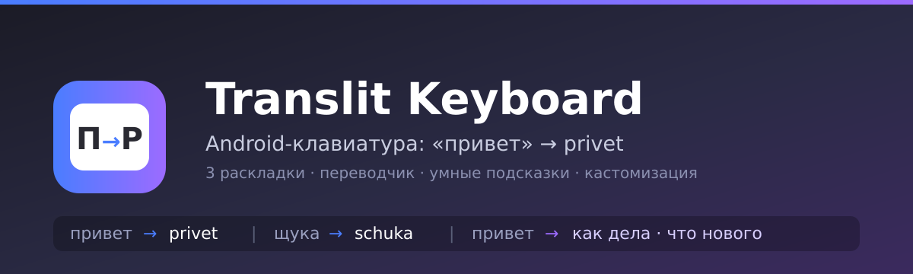

# Translit Keyboard



**Печатай по-русски — получай латиницу.** Android-клавиатура, которая превращает
«привет» в `privet`, подсказывает продолжение фразы и переводит на 16 языков.

Сделано с любовью к деталям: три раскладки, живой предикт, темы и полный контроль
над каждым пикселем клавиши.

## Возможности

- **3 раскладки**, переключение клавишей 🌍:
  - **Транслит** — русская раскладка ЙЦУКЕН, в текст попадает латиница (`привет` → `privet`)
  - **ЙЦУКЕН** — обычная русская клавиатура
  - **QWERTY** — английская клавиатура
- **Две таблицы транслитерации** (переключаются в настройках):
  - Разговорная: `й→y, ц→c, х→h, щ→sch` — «привет» → `privet`
  - Паспортная ICAO: `й→i, ц→ts, х→kh, щ→shch` — как в загранпаспорте
- **Переводчик** (кнопка 🌐 над клавиатурой, для ЙЦУКЕН и QWERTY): набираете текст,
  выбираете один из 16 языков, кнопка «⤵ Вставить перевод» заменяет исходный текст.
  Используется Google Translate с резервным MyMemory API.
- **Умная панель подсказок**: предикт слов по префиксу + ассоциативные фразы
  («привет» → «как дела», «что нового»), слова из системного словаря пользователя
- **Спецсимволы и эмодзи**: две страницы символов, панель эмодзи, долгое нажатие
  на клавиши (е→ё, -→—–•, $→₽ и т.д.)
- **Backspace по блокам**: «щ» → `sch` стирается одним нажатием
- **Полная кастомизация**: тёмная/светлая тема, 6 цветов акцента, высота клавиш,
  размер шрифта, вибрация, звук нажатия

## Сборка

Нужны: JDK 17+ и Android SDK (platform 35, build-tools 35).

```bash
# укажите путь к SDK в local.properties (sdk.dir=/path/to/android-sdk)
./gradlew assembleDebug
```

APK появится в `app/build/outputs/apk/debug/app-debug.apk`.

## Установка и активация через adb

```bash
adb install -r app/build/outputs/apk/debug/app-debug.apk
adb shell ime enable com.example.translit/.TranslitKeyboardService
adb shell ime set com.example.translit/.TranslitKeyboardService
```

Или вручную: приложение «Translit Keyboard» → кнопки 1 и 2 на главном экране
(включить в настройках → выбрать как текущую клавиатуру).

## Структура

```
app/src/main/java/com/example/translit/
├── TranslitKeyboardService.kt  — InputMethodService: раскладки, ввод, подсказки, перевод
├── TranslitMode.kt             — таблицы транслитерации (разговорная / ICAO)
├── Dictionary.kt               — словари, ассоциативные фразы, UserDictionary
├── Translator.kt               — Google Translate + MyMemory fallback
├── KbSettings.kt               — хранение настроек, темы/палитры
└── MainActivity.kt             — экран настроек и активации
```

## Лицензия

MIT — см. [LICENSE](LICENSE).
